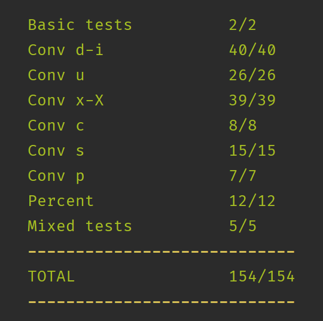
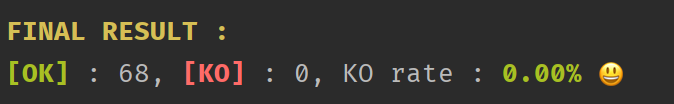

# ft_printf

* Synopsis : Ce projet est clair et efficace. Vous devez recoder printf. Vous aurez dès lors la possibilité de le réutiliser dans vos futurs projets. Ce projet porte principalement sur les arguments à taille variable.

<h3>Répartition du travail :</h3>
  * algorithmie : jchotel
  * parsing / norme : llaurent

<h1>Résultats de la moulinette :</h1>

  ....

<h1>Résultats avec différents testeurs :</h1>

  Curqui-test (https://github.com/curquiza/curqui_test)
   
  
   
  Mon main (https://github.com/brokenfiles/printf)
   
  

